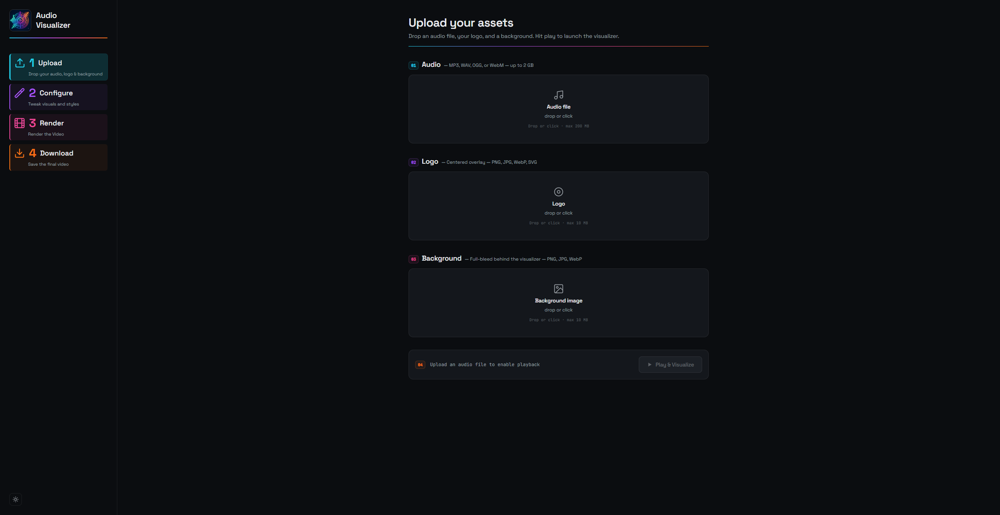
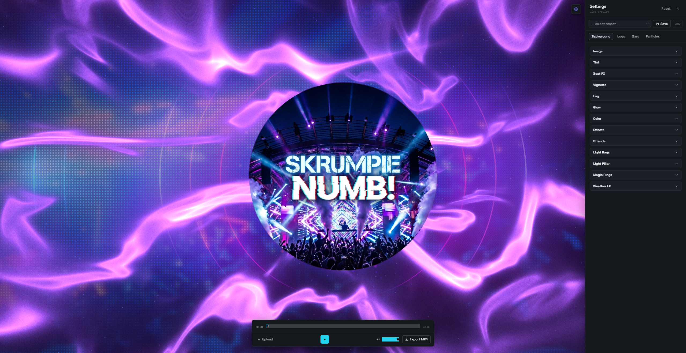
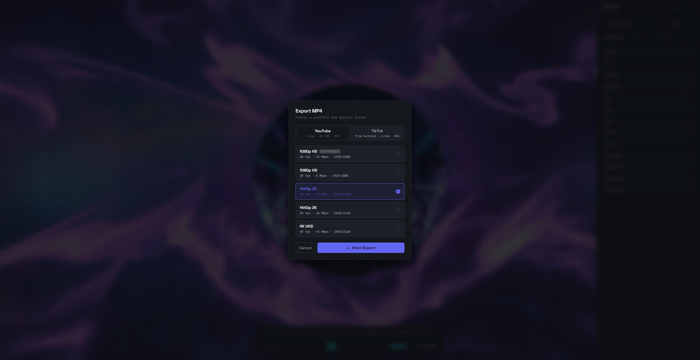
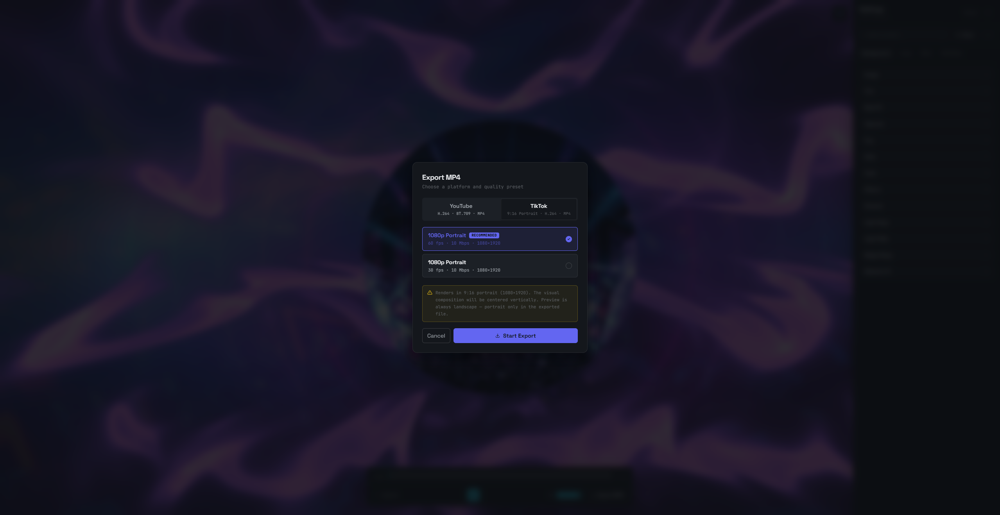

# Audio Visualizer

Client-only web app that turns an uploaded audio file into a real-time Three.js visualization and exports the result as an MP4 — ready for YouTube or TikTok.
No backend, no login, no tracking. Everything runs in the browser.
                                                                                                                       
                                                                                                                                       








## Demos

[](https://www.youtube.com/watch?v=ksfSVNRBrJY)

[](https://www.youtube.com/watch?v=nOnmXuzDtiI)

## Features

- **Drag-and-drop upload** for audio (MP3, WAV) and an optional logo / background image
- **Real-time 3D visualization** built on React Three Fiber — particles, instanced bars, nebula, god-rays, fire, magic rings, light pillars, and more
- **FFT-based beat detection** with per-effect frequency bands and sensitivity
- **Preset system** for quick look-and-feel switching
- **MP4 export** (H.264 + AAC) straight from the browser via the WebCodecs API — multiple quality presets (YouTube / TikTok)
- **Dark studio UI** with a four-step workflow: Upload → Configure → Render → Download

## Quick Start

```bash
git clone https://github.com/iSkrumpie/Audio-Visualizer.git
cd Audio-Visualizer
npm install
npm run dev
```

Then open <http://localhost:5173> in your browser, drop in an audio file, and start playing.

## Requirements

- **Node.js** 20 or newer (LTS recommended)
- **npm** 10 or newer (ships with Node)
- A **Chromium-based browser** — Chrome 94+ or Edge 94+
  - The MP4 export relies on the [WebCodecs API](https://developer.mozilla.org/en-US/docs/Web/API/WebCodecs_API), which is **not available in Firefox** at the time of writing
- **Operating systems:** Windows, macOS, Linux — anything that runs a modern Chromium browser

## Tech Stack

| Layer        | Library                                                       |
| ------------ | ------------------------------------------------------------- |
| Build        | Vite 8 + TypeScript 5.7 (project references)                 |
| UI           | React 19 + framer-motion 12                                   |
| 3D           | three 0.170 + @react-three/fiber 9 + @react-three/drei 10     |
| Audio        | Web Audio API (native dual-analyser) + essentia.js worker     |
| MP4 Encoding | mediabunny (WebCodecs wrapper — H.264 + AAC)                  |
| State        | zustand 5 (audio / settings / presets — all `persist`-backed) |
| Styling      | Tailwind v4 (CSS-first, `@tailwindcss/vite`)                  |
| Shaders      | GLSL imported as ES modules via `vite-plugin-glsl`            |

## Project Layout

```
public/                static assets (logo.png for favicon)
src/
├── components/        React UI (uploader, settings panel, overlays)
│   └── three/         R3F scene + effect components (audio-reactive shaders)
├── hooks/             useAudioReactive, useFileUpload, useExport, …
├── lib/               FFT pipeline, export engine, zustand stores, utilities
├── workers/           essentia.js Web Worker
└── main.tsx           entry point           
```

## Contributing

Issues and pull requests are welcome. 
If you plan a larger change or you have an feature request, please open an issue first so we can discuss the approach. 
The project uses Conventional Commits for commit messages.

## License

[MIT](./LICENSE) — Copyright (c) 2026 Skrumpie